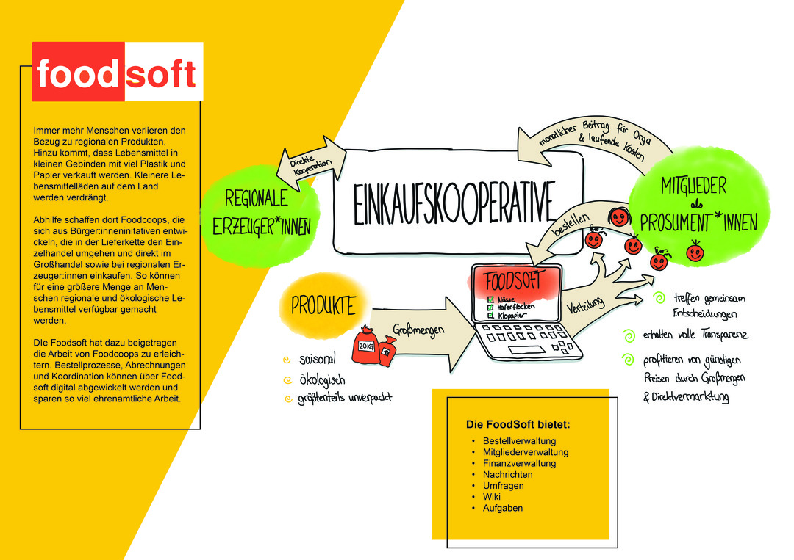
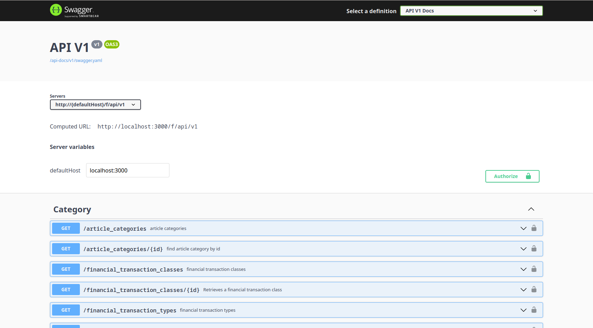
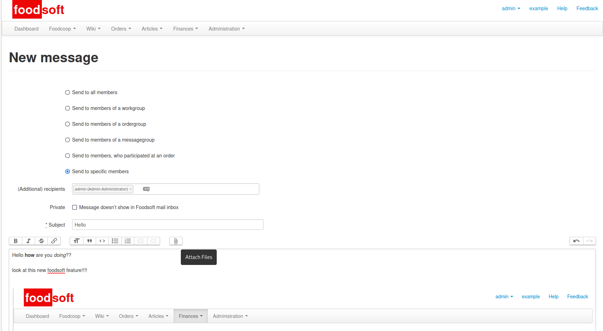
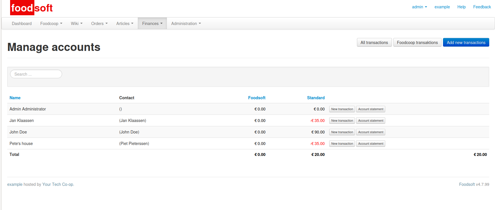
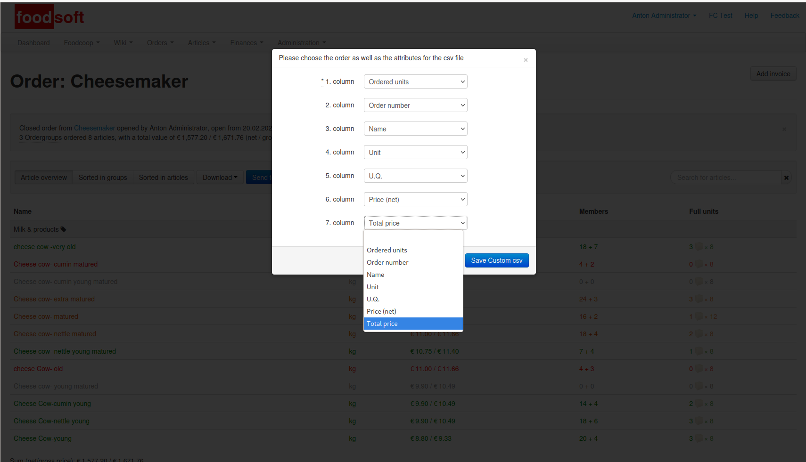
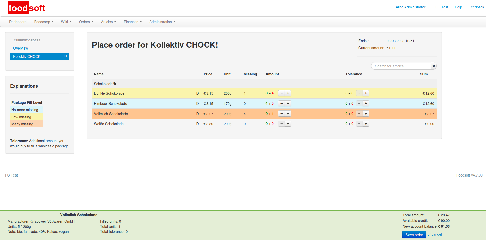

Foodsoft
=========

[Website](https://foodsoft.local-it.org)  
[Prototypefund](https://prototypefund.de/project/weiterentwicklung-von-foodsoft/)

Foodsoft ist ein Tool für [Lebensmittelkooperativen](https://de.wikipedia.org/wiki/Lebensmittelkooperative), welches selbstorganisierte gemeinsame Bestellungen in Großmengen von regionalen und ökologischen Produkten vereinfacht und transparent gestaltet.

Foodsoft wurde ursprünglich entwickelt und betrieben von [foodcoops.net](https://foodcoops.net/)

#### Zielgruppe

Unsere Zielgruppen sind Bürger:innen, Gruppen und Vereine, die eine Einkauskooperative aufbauen wollen und eine Software, die die Bestellung, Verteilung und Abrechnung erleichtert, benötigen.

#### Vorhaben 

* ✅  Technische Schuld reduzieren
* ✅  Ruby on Rails Upgrade
* ✅  Artikel Import verbessern
      (Großhandelschnitstelle)
* ✅ Userexperience Verbessern

#### Was ist eine Einkaufskooperative?

State of this Fork
------------------

#### Increase Test Coverage

1. integration and model tests
    * [x] fork
    * [x] upstream [#966](https://github.com/foodcoops/foodsoft/pull/966)
1. Controller tests
    * [x] [fork](https://git.local-it.org/Foodsoft/foodsoft/src/branch/8_increase_test_coverage_controllers)
    * [ ] upstream [#970](https://github.com/foodcoops/foodsoft/pull/970)

#### Upgrade

1. Migrate to RSwag API Tests
    * [x] [fork](https://git.local-it.org/Foodsoft/foodsoft/src/branch/28_introduce_rswag)
    * [ ] upstream [#969](https://github.com/foodcoops/foodsoft/pull/969)
1. Rails v7
    * [x] [fork](https://git.local-it.org/Foodsoft/foodsoft/src/branch/9_rails_v_7)
    * [ ] upstream [#979](https://github.com/foodcoops/foodsoft/pull/979)
          disussion [#956](https://github.com/foodcoops/foodsoft/issues/956)
1. Javascript Importmap
    * [x] [fork](https://git.local-it.org/Foodsoft/foodsoft/src/branch/9_rails_v_7_js_importmap)
    * [ ] upstream

#### Article Order Import/Export

Updating Articles from large resellers and exporting orders is now much easier!

1. adds bnn fileformat that is used from large german resellers e.g. naturkost nord
    * [x] [fork](https://git.local-it.org/Foodsoft/foodsoft/src/branch/11_bnn_import_article_update)  
          [gem](https://git.local-it.org/Foodsoft/foodsoft_article_import)
    * [ ] upstream  
1. Import category field
    * [x] [fork](https://git.local-it.org/Foodsoft/foodsoft/src/branch/56_add_update_of_article_category_to_file_import)
    * [ ] upstream
1. Export order as a custom csv file
    * [x] [fork](https://git.local-it.org/Foodsoft/foodsoft/src/branch/12_generate_custom_csv_file)
    * [ ] upstream  
1. Naturkostnord Plugin
    * [ ] [fork](https://git.local-it.org/Foodsoft/foodsoft/src/branch/12_nkn_file_plugin)
    * [ ] upstream

#### Improve User Experience

1. Richtext editor for messages. Also allows sending attachements.
    * [x] [fork](https://git.local-it.org/Foodsoft/foodsoft/src/branch/16_html_message_templates)
    * [ ] upstream  
1. Show the sum of all order group balances
    * [x] [fork](https://git.local-it.org/Foodsoft/foodsoft/src/branch/47_finance_ordergroup_sums)
    * [ ] upstream  
1. UI improvements for group order view
    * [x] [fork](https://git.local-it.org/Foodsoft/foodsoft/src/branch/uxui_group_order)
    * [ ] upstream
1. Favorites
    * [ ] [fork](https://git.local-it.org/Foodsoft/foodsoft/src/branch/20_favourites)
    * [ ] upstream
1. Show the per kilo / litre price
    * [x] [fork](https://git.local-it.org/Foodsoft/foodsoft/src/branch/11_include_kilo_litre_price)
    * [ ] upstream

#### Other

1. Fix broken plugin mechanism
    * [x] [fork](https://git.local-it.org/Foodsoft/foodsoft/src/branch/downgrade-haml)
    * [ ] upstream

#### Screenshots

---

---

---

---

csv export

---

